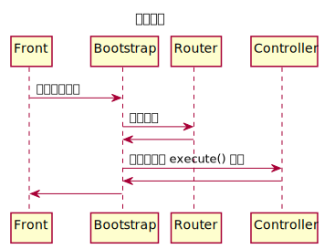
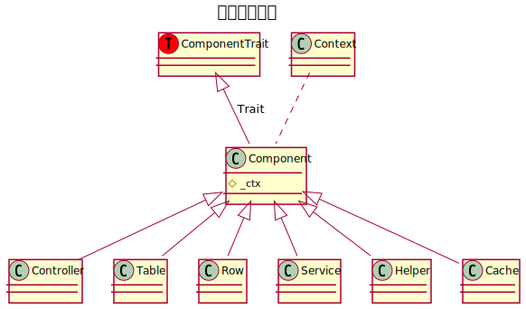
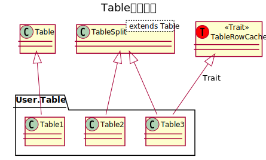

PHP Framework
========
这是一个用于中小型团队开发的框架

特点
----
* 非常简洁
* 支持Swoole
* 提供最常用的功能
* 容易扩展和替换需要功能
* 提供了简单的主从库方案
* 提供了简单的分表分库机制
* 提供了简单的数据批量加载方案
* 提供适用大多数情的行/列表缓存
* 提供了直接的静态文件方案

使用示例
----
一个简单的个人博客[bybzmt/blog.php](https://github.com/bybzmt/blog.php)

性能
----
基于此框架的个人博客[bybzmt/blog.php](https://github.com/bybzmt/blog.php)有非常强大的性能

* 环境: Debian9 + nginx/1.10.3 + PHP/7.0.27 + Swoole/2.1.2-alpha
* 硬件: i7-7700T + 16G + ssd/sm951
* ab -c 10 -n 100000 -k http://blog/

|  模式  | 静态文件 | 首页(2篇博客) | 首页(10篇博客)
|--------|----------|---------------|-----------------------
|Fpm     | 4705     | 1507          | 1237
|Swoole  | 26607    | 3276          | 2084

* 静态文件，相当echo "Hello Word!"，只是内容更多
* 由于计算力所限10条博客时有较大下降，这可以通过堆机器解决
* 由于使用了行/列表缓存此测试实际只访问了memcache并没有访问mysql

典型目录结构
----
```
├── assets       资源目录(如:字体文件等)
├── config
│   ├── dev      开发环境配置
│   ├── product  生产环境配置
├── index.php    项目入口
├── library      其它与composer不兼容的库
├── src
│   ├── Admin    管理后台
│   ├── Api      app接口端
│   ├── Backend  内部(内网)接口
│   ├── Common   公共代码目录
│   ├── Console  控制台
│   ├── Wap      手机Web端
│   └── Web      Web端
├── static
│   ├── admin    后台静态文件
│   └── web      Web端静态文件
├── tests        单元测试目录
├── var          可读写目录(如:模板缓存等)
└── vendor       composer库
```

启动流程
----
1. 设置环境变量
2. 引入composer自动加载
3. 启动Front::run()
4. 根据请求找到对应模块
5. 启动对应模块Bootstrap::run()
6. 初始化请求上下文对像
7. 路由请求得到控制器
8. 执行控制器



Context上下文对像
----
由于Swoole是一种常驻内存模式，全局变量的生命周期是应用级，而不同于fpm模式下只是请求级的。
全局变量能在不同请求间保持，所以$_GET、$_POST等原方法都不能用了。
这里框架给每个请求实例化一个Context对像，将所有跟当前请求相关的数据存到Context对像中。

Context对像还负责组件按层级加载和替换功能。

如上面博客中:
1. Web\Context对像继承于Common\Context对像
2. Common\Context对像继承于Framework\Context对像

当初始化组件时Context对像会首先在自己的命名空间中寻找对应组件，如果没找到则让父级Context进行初始化。
这样子可以很方便的扩展和替换自己所需要的组件。

api:
* Context->request 请求对像
* Context->response 响应对像
* Context->initComponent($name, ...$args) 实例化组件
* Context->getComponent($name) 得到实例化的组件
* Context->now() 当前时间，相当于$_SERVER['REQUEST_TIME']

Request、Response对像
----
Request对像是直接使用的[swoole_http_request](https://wiki.swoole.com/wiki/page/328.html)

Response对像同样是直接使用[swoole_http_response](https://wiki.swoole.com/wiki/page/329.html)

在Fpm模式中框架实现一个兼容层保持了和Swoole中一样的api

组件
------
框架里把所有跟Context对像有关的对像都实现为了Component,
主要是提供快速实例化功能，不需要反复传递Context对像。

另外Component也现实了一些便捷方法方便在任意组件内使用。



路由
------
路由并没有采用开放式映射式的，而是采用了注册式路由，优点是路由比较干净。

路由项目位于[bybzmt/router.php](https://github.com/bybzmt/router.php)

如果不喜欢可以替换为你喜欢的库，框架替换组件非常简单。

业务模型
------
框架推荐使用领域模型模式，使用: Service、Table、Row(Domain)结构

* Service层主要是按大的模块划分，如Blog模块，用户模块主要是负责“启头”和各种不方便划分到领域对像中的业务
* Table层只负责数据工作，包括sql组织，缓存维护，分表分库工作等
* Row层则是业务层

需要注意的是不要把数据展示的工作写到Service、Table、Row中去，它位只负责提供最基本的数据，
按页面、api要求组织对应的数据结构应该在控制器、视图中实现

数据库
-----
数据库分为提供基础功能的Table类，提供分表功能的TableSplit类。
另外有提供缓存功能的TableRowCache trait。
任何用户的表应都该继承于Table或TableSplit类，并当需要缓存时引入TableRowCache trait即可。



注意分表和缓存都只是对Table类中的get/gets/insert/update/delete这几个操作进行了支持。
当用SQL直接进行数据操作时需要手动维护相关缓存或分表功能。

批量加载
------
框架提供了LazyRow加载方法，当实例化时只是记录id，到访问属性才再试图批量加载。
* 优点：可以转一般的循环中的单条加载变为批量加载
* 缺点：当对应的id查无此记录时，LazyRow实例化，需作额外判断

助手层
-----
框架提供了一些常用功能方便使用

* Captcha 验证码生成
* Resource 资源获取 (如: mysql)
* Security 安全限制
* Session 会话机制(替代$_SESSION)
* SQLBuilder sql构建工具
* StaticFile 响应静态文件
* Utils 实用工具

Cache缓存
------
这个缓存跟上面Table中的缓存没有关系，它是指用户自己维护的缓存。
尽量让不同类型的缓存用不同的类去管理，避免key冲突。

模板
-----
框架没有提供模板功能，建议直接使现现有第三方模板程序。(如:Twig)

写在最后
-----
1. 框架的各功能并没有想适应所有环境，只需要在80%情况下可用就行了，特殊情况在具体的项目中可以特殊处理。

2. 框架的代码不多，如果想用尽量把代码都读一遍。
